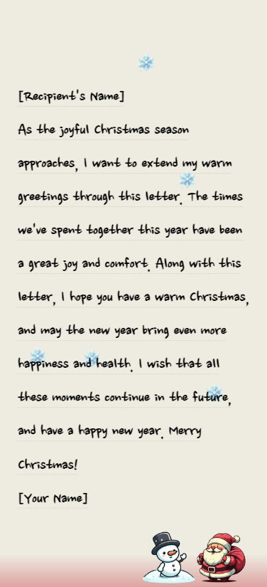

# Christmas Letter Template

Here's a comprehensive guide on how to use and customize this template.

## Features

- **Snowy Background**: Multiple snow images create a charming winter scene.
- **Customizable Letter**: The template includes a section where you can personalize the message with the recipient's and your name.
- **Festive Music**: An autoplay Christmas music feature enhances the festive mood (with manual play/pause option).
- **Interactive Elements**: Clickable elements that trigger audio play.
- **Holiday Images**: Santa and snowman images add to the Christmas theme.

## How to Use

1. **Edit the Letter**: Open `index.html` and replace `[Recipient's Name]` and `[Your Name]` in the `<h2>` tag with the actual names.
2. **Customize Style**: Modify `index.css` if you want to change the visual design.
3. **Update Assets**: Add or replace images and music in the `asset/` folder as needed.
4. **Preview**: Open `index.html` in a browser to see your changes.
5. **Send**: Host the files on [Netlify](https://www.netlify.com/) and share the link, or convert the HTML to a format suitable for email.

## Browser Compatibility

The template is compatible with modern mobile browsers.

## Files Included

- `index.html`: The main HTML file containing the structure of the letter.
- `index.css`: CSS file for styling the letter.
- `asset/`: Folder containing images (`snow.png`, `snowman.png`, `santa.png`) and music (`christmas.mp3`).

## License

This template is free to use and modify for personal purposes.

Created by SeongYong

---

Merry Christmas! 🎄

# 크리스마스 편지 템플릿

템플릿을 사용하는 방법에 대한 종합적인 가이드입니다.

## 사용 방법

1. **편지 수정**: `index.html`을 열고 `<h2>` 태그 안의 `[Recipient's Name]`과 `[Your Name]`을 실제 이름으로 바꿉니다.
2. **스타일**: 시각적 디자인을 변경하고 싶다면 `index.css`를 수정하세요.
3. **이미지 또는 음악 변경**: 필요에 따라 `asset/` 폴더에 이미지와 음악을 추가하거나 교체하세요.
4. **미리보기**: `index.html`을 브라우저에서 열어 변경 사항을 확인하세요.
5. **전송**: 파일을 [Netlify](https://www.netlify.com/)에 호스팅하고 링크를 공유하거나, HTML을 이메일에 적합한 형식으로 변환하세요.

## 브라우저 호환성

이 템플릿은 현대적인 모바일 브라우저와 호환됩니다.

## 포함된 파일들

- `index.html`: 편지의 구조를 담고 있는 메인 HTML 파일.
- `index.css`: 편지의 스타일을 위한 CSS 파일.
- `asset/`: 이미지 (`snow.png`, `snowman.png`, `santa.png`)와 음악 (`christmas.mp3`)을 담고 있는 폴더.

## 라이선스

이 템플릿은 개인적인 목적으로 사용하고 수정이 가능합니다.

Created by SeongYong

---

메리크리스마스! 🎄
